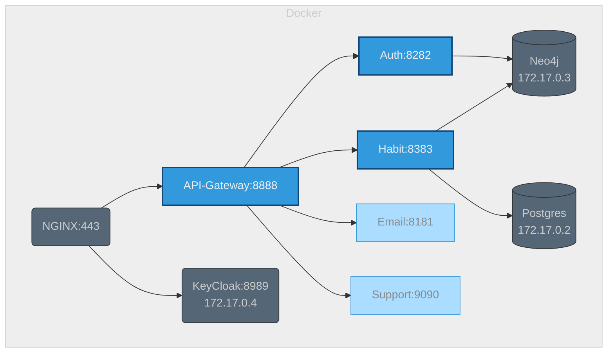
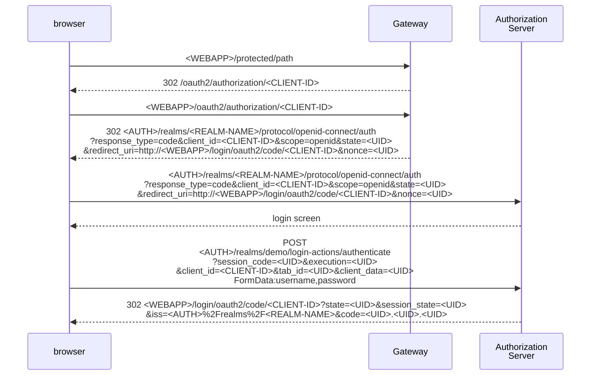
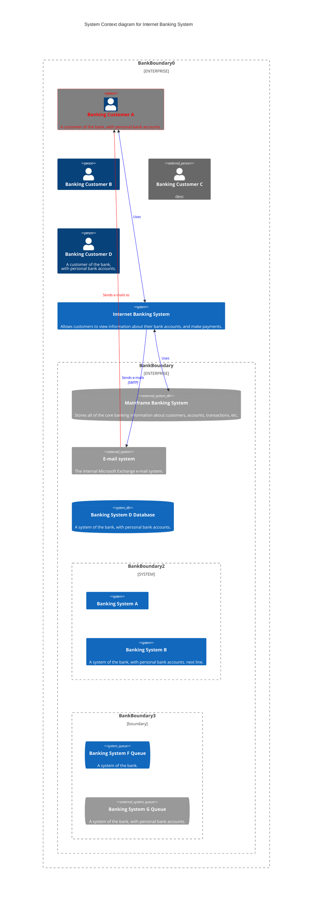

## Mermaid

- Read [mermaid live editor](https://mermaid.live)

### Sample flow diagram

```mermaid
graph TD;
    A-->B;
    A-->C;
    B-->D;
    C-->D;
```

### Complex flow diagram

```mermaid
flowchart TD
    Docker
    style Docker fill:#eee,stroke:#ccc,stroke-width:1px,color:#ccc
    NGINX(NGINX:443)
    style NGINX fill:#567,stroke:#333,stroke-width:1px,color:#ccc
    PG[(Postgres<br/>172.17.0.2)]
    style PG fill:#567,stroke:#333,stroke-width:1px,color:#ccc
    NEO4J[(Neo4j<br/>172.17.0.3)]
    style NEO4J fill:#567,stroke:#333,stroke-width:1px,color:#ccc
    KC(KeyCloak:8989<br/>172.17.0.4)
    style KC fill:#567,stroke:#333,stroke-width:1px,color:#ccc
    APIG[API-Gateway:8888]
    style APIG fill:#39d,stroke:#147,stroke-width:2px,color:#eee
    EMAIL[Email:8181]
    style EMAIL fill:#adf,stroke:#39d,stroke-width:1px,color:#888
    AUTH[Auth:8282]
    style AUTH fill:#39d,stroke:#147,stroke-width:2px,color:#eee
    HABIT[Habit:8383]
    style HABIT fill:#39d,stroke:#147,stroke-width:2px,color:#eee
    SUPPORT[Support:9090]
    style SUPPORT fill:#adf,stroke:#39d,stroke-width:1px,color:#888
    subgraph Docker
    NGINX-->APIG
    NGINX-->KC
    APIG-->AUTH
    APIG-->HABIT
    APIG-->EMAIL
    APIG-->SUPPORT
    AUTH-->NEO4J
    HABIT-->NEO4J
    HABIT-->PG
    end
```

### Complex sequence diagram

```mermaid
sequenceDiagram
    participant B as browser
    participant GW as Gateway
    participant AS as Authorization<br/>Server
    B->>GW: <WEBAPP>/protected/path
    GW-->>B: 302 /oauth2/authorization/<CLIENT-ID>
    B->>GW: <WEBAPP>/oauth2/authorization/<CLIENT-ID>
    GW-->>B: 302 <AUTH>/realms/<REALM-NAME>/protocol/openid-connect/auth<br/>?response_type=code&client_id=<CLIENT-ID>&scope=openid&state=<UID><br/>&redirect_uri=http://<WEBAPP>/login/oauth2/code/<CLIENT-ID>&nonce=<UID>
    B->>AS: <AUTH>/realms/<REALM-NAME>/protocol/openid-connect/auth<br/>?response_type=code&client_id=<CLIENT-ID>&scope=openid&state=<UID><br/>&redirect_uri=http://<WEBAPP>/login/oauth2/code/<CLIENT-ID>&nonce=<UID>
    AS-->>B: login screen
    B->>AS: POST <br/><AUTH>/realms/demo/login-actions/authenticate<br/>?session_code=<UID>&execution=<UID><br/>&client_id=<CLIENT-ID>&tab_id=<UID>&client_data=<UID><br/>FormData:username,password
    AS-->>B: 302 <WEBAPP>/login/oauth2/code/<CLIENT-ID>?state=<UID>&session_state=<UID><br/>&iss=<AUTH>%2Frealms%2F<REALM-NAME>&code=<UID>.<UID>.<UID>
```

### Complex C4 Model Diagram

```mermaid
    C4Context
      title System Context diagram for Internet Banking System
      Enterprise_Boundary(b0, "BankBoundary0") {
        Person(customerA, "Banking Customer A", "A customer of the bank, with personal bank accounts.")
        Person(customerB, "Banking Customer B")
        Person_Ext(customerC, "Banking Customer C", "desc")

        Person(customerD, "Banking Customer D", "A customer of the bank, <br/> with personal bank accounts.")

        System(SystemAA, "Internet Banking System", "Allows customers to view information about their bank accounts, and make payments.")

        Enterprise_Boundary(b1, "BankBoundary") {

          SystemDb_Ext(SystemE, "Mainframe Banking System", "Stores all of the core banking information about customers, accounts, transactions, etc.")

          System_Boundary(b2, "BankBoundary2") {
            System(SystemA, "Banking System A")
            System(SystemB, "Banking System B", "A system of the bank, with personal bank accounts. next line.")
          }

          System_Ext(SystemC, "E-mail system", "The internal Microsoft Exchange e-mail system.")
          SystemDb(SystemD, "Banking System D Database", "A system of the bank, with personal bank accounts.")

          Boundary(b3, "BankBoundary3", "boundary") {
            SystemQueue(SystemF, "Banking System F Queue", "A system of the bank.")
            SystemQueue_Ext(SystemG, "Banking System G Queue", "A system of the bank, with personal bank accounts.")
          }
        }
      }

      BiRel(customerA, SystemAA, "Uses")
      BiRel(SystemAA, SystemE, "Uses")
      Rel(SystemAA, SystemC, "Sends e-mails", "SMTP")
      Rel(SystemC, customerA, "Sends e-mails to")

      UpdateElementStyle(customerA, $fontColor="red", $bgColor="grey", $borderColor="red")
      UpdateRelStyle(customerA, SystemAA, $textColor="blue", $lineColor="blue", $offsetX="5")
      UpdateRelStyle(SystemAA, SystemE, $textColor="blue", $lineColor="blue", $offsetY="-10")
      UpdateRelStyle(SystemAA, SystemC, $textColor="blue", $lineColor="blue", $offsetY="-40", $offsetX="-50")
      UpdateRelStyle(SystemC, customerA, $textColor="red", $lineColor="red", $offsetX="-50", $offsetY="20")

      UpdateLayoutConfig($c4ShapeInRow="3", $c4BoundaryInRow="1")
```